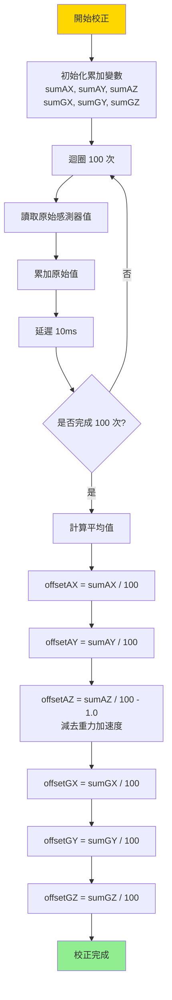
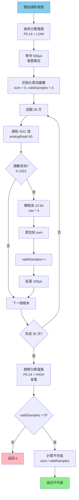
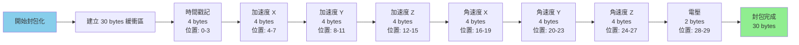
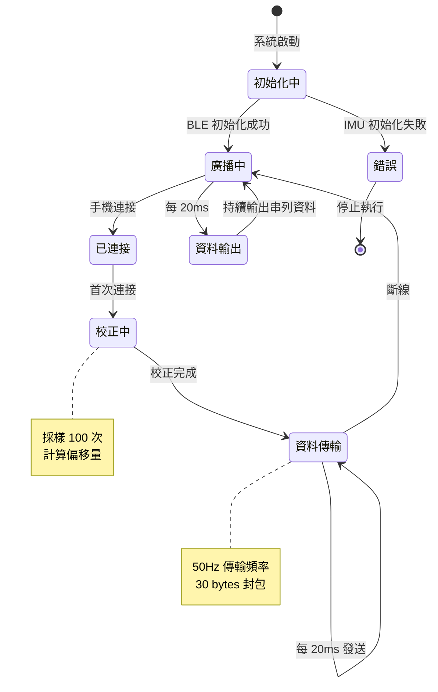

# SmartRacket IMU BLE 傳輸系統 - 程式執行流程圖

## 整體系統流程圖

```mermaid
flowchart TD
    Start([系統啟動]) --> Setup[setup 函數執行]
    
    Setup --> InitSerial[初始化串列通訊<br/>9600 bps]
    InitSerial --> InitI2C[初始化 I2C 通訊<br/>400kHz]
    InitI2C --> InitIMU{IMU 初始化成功?}
    
    InitIMU -->|失敗| Error1[輸出錯誤訊息<br/>停止執行]
    InitIMU -->|成功| InitLED[初始化 LED 腳位]
    
    InitLED --> InitBLE[初始化 BLE]
    InitBLE --> BLEConfig[設定 BLE 服務與特徵<br/>設備名稱: SmartRacket]
    BLEConfig --> BLEAdvertise[開始 BLE 廣播]
    BLEAdvertise --> Loop[進入 loop 主迴圈]
    
    Loop --> PollBLE[BLE.poll 處理事件]
    PollBLE --> CheckConnection{檢查 BLE 連接狀態}
    
    CheckConnection -->|未連接| NoConnection[未連接模式]
    CheckConnection -->|已連接| Connected[已連接模式]
    
    NoConnection --> CheckDataTime1{到達資料輸出時間?<br/>20ms = 50Hz}
    CheckDataTime1 -->|是| ReadIMU1[讀取 IMU 資料<br/>減去校正偏移量]
    CheckDataTime1 -->|否| PollBLE
    ReadIMU1 --> ReadVoltage1[讀取電池電壓<br/>啟用分壓電路]
    ReadVoltage1 --> SerialOutput[串列埠輸出資料<br/>aX,aY,aZ,gX,gY,gZ,voltage]
    SerialOutput --> UpdateTime1[更新輸出時間]
    UpdateTime1 --> Delay1[延遲 10ms]
    Delay1 --> PollBLE
    
    Connected --> FirstCalibration{首次連接?<br/>未校正?}
    FirstCalibration -->|是| Calibrate[執行 IMU 校正<br/>採樣 100 次]
    FirstCalibration -->|否| CheckDataTime2{到達資料輸出時間?<br/>20ms = 50Hz}
    
    Calibrate --> CalcOffset[計算偏移量<br/>加速度 Z 軸減 1g]
    CalcOffset --> SetCalibrationDone[設定校正完成標記]
    SetCalibrationDone --> FirstConnection[首次連接處理<br/>初始化電壓緩存]
    FirstConnection --> CheckDataTime2
    
    CheckDataTime2 -->|是| ReadIMU2[讀取最新 IMU 資料<br/>減去校正偏移量]
    CheckDataTime2 -->|否| PollBLE
    
    ReadIMU2 --> CheckVoltageTime{需要更新電壓?<br/>每 10 秒或緩存為 0}
    CheckVoltageTime -->|是| ReadVoltageAvg[讀取 30 筆電壓取平均]
    CheckVoltageTime -->|否| UseCachedVoltage[使用緩存電壓值]
    
    ReadVoltageAvg --> UpdateVoltageCache[更新電壓緩存]
    UpdateVoltageCache --> UseCachedVoltage
    UseCachedVoltage --> PackData[封包化資料<br/>30 bytes 二進位格式]
    
    PackData --> PackTimestamp[時間戳 4 bytes]
    PackTimestamp --> PackAccel[加速度 X,Y,Z 各 4 bytes]
    PackAccel --> PackGyro[角速度 X,Y,Z 各 4 bytes]
    PackGyro --> PackVoltage[電壓 2 bytes]
    
    PackVoltage --> SendBLE[透過 BLE 發送資料]
    SendBLE --> SendSuccess{發送成功?}
    SendSuccess -->|失敗| BLEError[輸出錯誤訊息]
    SendSuccess -->|成功| UpdateSendTime[更新傳輸時間]
    BLEError --> UpdateSendTime
    UpdateSendTime --> PollBLE
    
    style Start fill:#90EE90
    style Error1 fill:#FFB6C1
    style Connected fill:#87CEEB
    style NoConnection fill:#DDA0DD
    style Calibrate fill:#FFD700
    style SendBLE fill:#98FB98
```

## IMU 校正流程詳圖

## 電壓讀取流程詳圖

## 資料封包結構

## 系統狀態機

## 時間軸流程圖

```mermaid
gantt
    title SmartRacket 系統執行時間軸
    dateFormat X
    axisFormat %L ms
    
    section 初始化階段
    setup() 執行           :0, 100
    
    section 主迴圈 (每 20ms)
    BLE.poll()             :100, 1
    讀取 IMU 資料          :101, 2
    讀取電壓               :103, 1
    串列輸出               :104, 1
    BLE 資料封包化         :105, 2
    BLE 發送               :107, 1
    
    section 電壓更新 (每 10 秒)
    讀取 30 筆電壓取平均   :10000, 50
    
    section IMU 校正 (首次連接)
    採樣 100 次            :200, 1000
```

## 關鍵參數說明

| 參數 | 數值 | 說明 |
|------|------|------|
| 資料輸出頻率 | 50Hz | 每 20ms 輸出一次 |
| BLE 傳輸頻率 | 50Hz | 每 20ms 傳輸一次 |
| 電壓讀取間隔 | 10 秒 | 每 10 秒更新一次電壓緩存 |
| 電壓採樣次數 | 30 次 | 每次讀取 30 筆取平均 |
| IMU 校正採樣 | 100 次 | 校正時採樣 100 次 |
| I2C 時鐘頻率 | 400kHz | 高速模式 |
| 串列通訊速率 | 9600 bps | 除錯用 |
| 資料封包大小 | 30 bytes | 時間戳 4 + 加速度 12 + 陀螺儀 12 + 電壓 2 |

## 資料流程說明

1. **初始化階段 (setup)**
   - 初始化所有硬體介面
   - 設定 BLE 服務和特徵
   - 開始 BLE 廣播

2. **主迴圈 (loop)**
   - 持續處理 BLE 事件
   - 無論是否連接，每 20ms 讀取一次 IMU 資料
   - 已連接時，每 20ms 透過 BLE 發送資料
   - 未連接時，僅輸出串列資料

3. **IMU 校正**
   - 首次 BLE 連接時自動執行
   - 採樣 100 次計算偏移量
   - 加速度 Z 軸需減去重力加速度 (1g)

4. **電壓監控**
   - 每 10 秒更新一次電壓緩存
   - 每次讀取 30 筆取平均以提高穩定性
   - 使用分壓電路，讀取後立即關閉以省電

5. **資料封包**
   - 30 bytes 二進位格式
   - Little-Endian 位元組順序
   - 包含時間戳、六軸資料和電壓

---

**最後更新：** 2024年  
**維護者：** DIID Term Project Team

