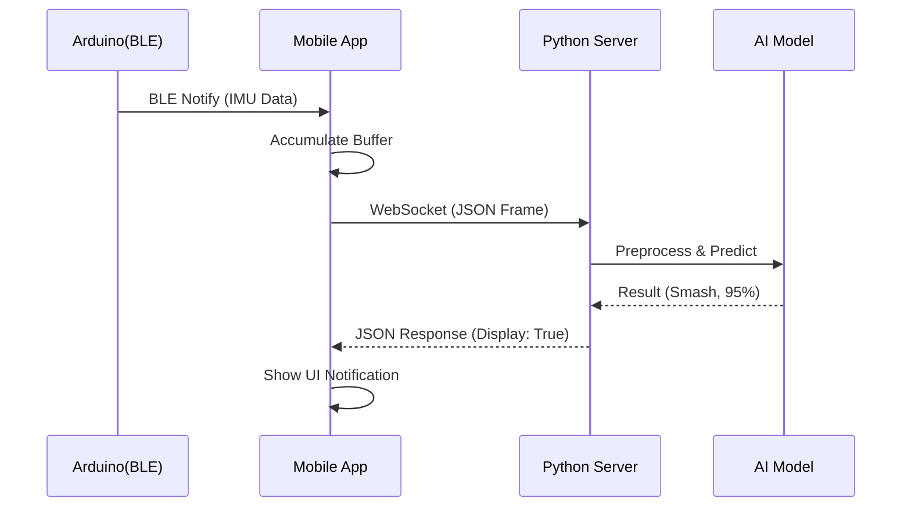

# 🧠 Smart Racket AI Server


## 📌 系統簡介 (Overview)
這是 **Smart Racket** 的後端核心，負責接收來自手機轉發的 IMU 原始數據，並透過深度學習模型即時辨識揮拍動作。
系統包含兩個主要的 AI 模型：
1. **動作分類器 (Classifier)**: 辨識動作類型 (Smash, Drive, Toss, Drop)。
2. **球速預估器 (Speed Regressor)**: 針對殺球 (Smash) 動作預測擊球速度。

---

## 🏗️ 系統架構 (Architecture)

### 📂 檔案結構
- `main.py`: 伺服器主程式，包含 WebSocket 處理與模型推論邏輯。
- `badminton_model_v4.h5`: 動作分類模型 (Keras H5)。
- `speed_estimation_model.h5`: 球速預測模型。

### 🔄 資料流 (Data Flow)


---

## 🧠 AI 模型說明 (AI Models)

### 1. 動作分類模型 (Action Classifier)
- **輸入**: 40 frames x 6 features (AccX, Y, Z, GyroX, Y, Z).
- **前處理**: Z-Score Normalization (使用訓練集的 Mean/Std).
- **輸出**: 4 類機率分佈 (Drive, Drop, Smash, Toss).
- **信心度門檻**: `0.5` (低於此值視為無效動作 "Other").

### 2. 球速預測模型 (Speed Regressor)
- **觸發條件**: 當分類結果為 `Smash` 時觸發。
- **輸入**: 原始 Raw Data (不經過 Normalization).
- **輸出**: 預測球速 (km/h).

---

## 🚀 啟動方式 (Usage)

### 1. 安裝依賴 (Install Dependencies)
請確保已安裝 Python 3.9+，並執行：
```bash
pip install "fastapi[all]" tensorflow numpy
```

### 2. 啟動伺服器 (Start Server)
```bash
python main.py
```
伺服器將啟動於 `0.0.0.0:8000`。

### 3. API 測試
伺服器啟動後，可瀏覽 `http://localhost:8000/docs` 查看 Swagger 文件，或使用 WS 工具連線 `ws://localhost:8000/ws/predict` 進行測試。

---

## 📊 API 格式 (API Reference)

### WebSocket Endpoint: `/ws/predict`

#### Request (Client -> Server)
```json
{
  "client_id": "Device_001",
  "data": [
    {"ts": 12345.0, "acc": [0.1, 0.2, 9.8], "gyro": [1.0, 2.0, 0.5]},
    ... (40 frames)
  ]
}
```

#### Response (Server -> Client)
```json
{
  "type": "Smash",
  "confidence": 0.98,
  "speed": 125.5,
  "display": true,
  "message": "Smash! 125.5 km/h"
}
```
